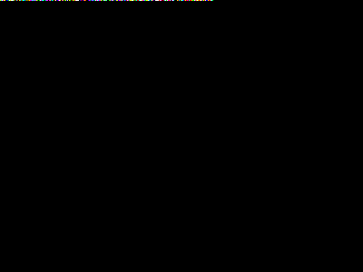

# Steganography Tool — Hide Data in Images (LSB)

A command-line tool that hides secret text messages inside PNG images using
**Least Significant Bit (LSB) steganography**, with an optional XOR
password layer. Built as a digital forensics / cybersecurity portfolio
project.

---

## What is steganography?

Cryptography hides the *content* of a message, anyone can see there's a
message, they just can't read it. **Steganography hides the *existence* of
the message** — the goal isn't to make the message unreadable, it's to make
it invisible in the first place. A file that looks like an ordinary holiday
photo can carry a hidden document, and nobody looking at it would think to
check.

The word comes from the Greek *steganos* ("covered") and *graphein*
("writing") — literally "covered writing."

### The LSB technique

Every pixel in a digital image is made of colour channel values, usually
Red, Green, and Blue, each stored as a number from 0–255 (8 bits).

If you change the **most significant bit** of a value like `200`
(`11001000`), you get `72` (`01001000`) — a huge, visible jump.

If you change the **least significant bit** instead, `200` (`1100100`**`0`**)
becomes `201` (`1100100`**`1`**) — a difference of 1 out of 255. That's far
too small a shift in colour for the human eye to notice, but it's a real,
readable bit of data that a program can extract.

So the technique is simple:

1. Take your secret message and turn it into a stream of individual bits.
2. Walk through the image's pixel colour values one by one.
3. Overwrite the last bit of each value with the next bit of your message.
4. Save the image. It looks the same. It now contains your message.

Decoding just reverses the process: read the last bit of every colour
value back out, in the same order, and reassemble the original bytes.

This tool also embeds a 32-bit **length header** before the message itself,
so the decoder knows exactly when to stop reading — no visible marker or
special end-of-message symbol needed in the image.

### Why PNG, not JPEG?

JPEG uses **lossy compression** — it deliberately throws away "unimportant"
detail to shrink the file, which would silently destroy the exact bit
pattern the hidden message depends on. PNG is **lossless**: every pixel
value is stored exactly as written, so the hidden bits survive perfectly.
This tool always saves output as PNG regardless of the input format.

---

## Real-world context

Steganography isn't just a classroom exercise — it shows up across
legitimate and illegitimate uses alike:

- **Digital watermarking**: photographers and stock media companies embed
  invisible ownership or licensing data directly into images, so stolen
  copies can still be traced back to the original source.
- **Espionage and intelligence**: hidden-message-in-image techniques have
  long been associated with covert communication — the idea of an
  innocuous-looking photograph carrying instructions or coordinates
  predates computers entirely (microdots and invisible ink were the
  physical-world equivalent used in both World Wars).
- **Cybercrime and malware**: some malware families use steganography to
  smuggle malicious payloads or command-and-control instructions inside
  image files attached to phishing emails or hosted on legitimate-looking
  websites, because network security tools that scan for suspicious text
  or executables often don't inspect image pixel data closely.
- **Journalism and activism**: in regions with heavy surveillance or
  censorship, steganography has been used to smuggle documents or
  communications past network inspection by disguising them as ordinary
  image files.
- **Digital forensics**: because of all of the above, forensic
  investigators run **steganalysis** tools that look for statistical
  irregularities in LSB patterns — a truly random-looking noise pattern in
  the least significant bits of an otherwise smooth image is a red flag
  that something may be hidden inside.

This dual-use nature — legitimate watermarking on one hand, covert
exfiltration on the other — is exactly why steganography detection is a
skill SOC analysts and forensic investigators are expected to have.

---

## Password protection (XOR)

Before the message is embedded, it can optionally be XOR'd against a
password-derived key:

```
encrypted_byte[i] = message_byte[i] XOR password_byte[i % len(password)]
```

Without the correct password, the extracted bits decode into meaningless
garbage instead of the original text.

**Important security note:** XOR with a repeating key is included here for
educational purposes — it demonstrates the idea of layering a secondary
protection on top of the steganographic layer, and it is genuinely
useful as a way to keep a casual viewer who *does* find the hidden data
from reading it. However, it is **not real encryption**. It has no
resistance to frequency analysis, and (as our test suite discovered) a
close-but-wrong password can sometimes still decode to plausible-looking
garbage rather than failing loudly. For genuine confidentiality, encrypt
the message with a real cipher (e.g. AES-GCM) *before* handing it to this
tool.

---

## Installation

```bash
pip install pillow
```

(The bundled test suite additionally uses `numpy`, which is only needed
for generating synthetic test images and pixel-diff checks — not for the
core tool itself.)

---

## Usage

### Encode a message into an image

```bash
python3 stego.py encode -i cover.png -o secret.png -m "Meet at the old bridge at midnight."
```

With password protection:

```bash
python3 stego.py encode -i cover.png -o secret.png -m "Meet at the old bridge at midnight." -p hunter2
```

Or interactively (password hidden as you type):

```bash
python3 stego.py encode -i cover.png -o secret.png -m "Meet at the old bridge at midnight." --ask-password
```

From a text file instead of typing the message inline:

```bash
python3 stego.py encode -i cover.png -o secret.png -f message.txt
```

### Decode a message from an image

```bash
python3 stego.py decode -i secret.png
python3 stego.py decode -i secret.png -p hunter2
python3 stego.py decode -i secret.png --ask-password
```

### Check how much an image can hold

```bash
python3 stego.py capacity -i cover.png
```

```
Image: cover.png (400x300, mode=RGB)
Maximum message capacity: 44996 bytes (~43 KB)
```

Capacity scales directly with image size — roughly 1 byte of hidden
message per 8 colour channel values, i.e. about `width × height × 3 / 8`
bytes for an RGB image.

---

## Before / after example

The two images below are visually indistinguishable, but the second one
has an 84-byte hidden message embedded in it (`"The shipment leaves the
harbour at 03:00. Use the north gate, password is unchanged."`, XOR
protected with the password `lighthouse`):

| Original | With hidden message |
|---|---|
|  |  |

Out of the image's 120,000 individual colour values (400×300 pixels × 3
channels), only **207 pixels** were touched at all, and each one changed
by exactly **1 out of 255** in a single channel — nothing a human eye
could ever spot side-by-side, let alone in isolation.

To prove it, here's what those changes look like when the difference
between the two images is amplified ×255 so every altered bit becomes
fully visible. This is essentially a crude version of the kind of
statistical steganalysis a forensic tool would run to detect hidden data:



The scattered white specks are the *only* pixels that changed — everything
else is perfectly identical, confirming the message is both fully
recoverable and visually undetectable.

Recovering the message:

```bash
$ python3 stego.py decode -i examples/cover_with_hidden_message.png -p lighthouse
[OK] Hidden message recovered:
--------------------------------------------------
The shipment leaves the harbour at 03:00. Use the north gate, password is unchanged.
--------------------------------------------------
```

---

## Testing

`test_stego.py` generates synthetic test images and runs the full
encode → decode cycle across several scenarios: short messages, long
multi-sentence messages, Unicode/emoji content, password-protected
messages, a wrong-password case, and a capacity-overflow case. It also
verifies programmatically that no pixel value ever changes by more than 1
after encoding.

```bash
pip install pillow numpy
python3 test_stego.py
```

---

## Project structure

```
steganography-tool/
├── stego.py            # CLI entry point
├── stego_core.py        # Core encode/decode/XOR engine
├── test_stego.py         # Automated test suite
├── examples/              # Before/after images used in this README
│   ├── cover_original.png
│   ├── cover_with_hidden_message.png
│   └── diff_amplified_255x.png
└── README.md
```

## Limitations

- Only supports **text** messages (any byte payload would technically work,
  but the CLI is built around UTF-8 text).
- LSB steganography is one of the *simplest* and most well-known
  techniques — it is easily detected by dedicated steganalysis tools that
  look at LSB statistical randomness, so it should be treated as an
  educational/demonstration technique rather than a production-grade
  covert channel.
- XOR password protection is intentionally simple and should not be relied
  on for real confidentiality (see the security note above).
